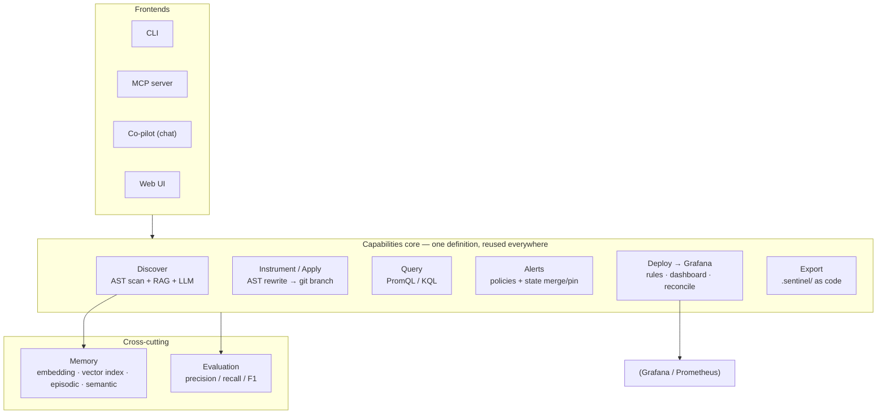

# 🛡️ Sentinel — an observability discovery agent

> Point it at a codebase. It figures out **what's worth monitoring**, writes the
> instrumentation, generates the queries, designs multi-severity alerts, and
> ships them to Grafana — as a one-shot command, a chat, or an MCP tool call.
>
> 把它对准一个代码库。它会算出**该监控什么**、写好埋点、生成查询、设计分级告警，
> 并一键推到 Grafana —— 命令行、对话、或 MCP 工具调用皆可。

<p align="center"><em>deterministic core · LLM-augmented · privacy-first · zero required dependencies · 39 tests passing</em></p>

---

## Why

Observability is usually bolted on *after* an incident, by hand, inconsistently.
Sentinel shifts it **left**: it reads the source, reasons about the golden
signals (RED/USE), and produces monitoring config **as code** — reviewable in a
PR, owned per module, and deployable via GitOps.

It is an **agent**, not a wizard: a conversational co-pilot plans and executes,
calling the same tools that are also exposed over the **Model Context Protocol**
so any LLM client can orchestrate it.

## Architecture



**Data flow:** `scan → discover → instrument → query → alert → deploy/export/dashboard`,
with an optional LLM enriching discovery and a memory layer that makes it scale
and *learn*.

## What it does

| Capability | Command | Notes |
| --- | --- | --- |
| **Discover** metrics from code | `discover` | AST scan (precise) + RAG + optional LLM (semantic) |
| **Instrument** missing metrics | `instrument` / `apply` | AST-safe rewrite, committed to a git branch you name |
| **Query** generation | `query` | PromQL / KQL per metric |
| **Alerts** (as code) | `alerts --state` | multi-severity policies; 3-way merge keeps human-`pinned` thresholds |
| **Deploy to Grafana** | `deploy-alerts` | Grafana-managed rules wired to a contact point; `--prune` reconciles obsolete rules (dry-run) |
| **Dashboard** | `dashboard --deploy` | one panel per metric, grouped by feature |
| **Export** (observability-as-code) | `export` | `.sentinel/<feature>/{alerts.rules.yml, queries, metrics.json}` |
| **Feedback / learning** | `feedback` | approve/reject a metric → future runs suppress the rejected ones |
| **Evaluate quality** | `eval` | precision / recall / F1 vs ground truth, static-vs-LLM ablation |

Plus three ways to drive it: a **Web UI** (`sentinel.webapp`), an **MCP server**
(`sentinel.mcp_server`), and a **conversational co-pilot** (in the Web UI).

## Design highlights

- **Deterministic core + LLM augmentation.** The backbone is a precise AST scan;
  the LLM only *adds* semantic/business metrics on top. Runs fully offline when
  the LLM is unavailable — reliability and privacy by construction.
- **Privacy tiers.** `air-gapped` (static only) → `private-llm` (local model) →
  `external-llm` (cloud). The retrieval embedding tier follows the same ladder
  (TF-IDF → local Transformer → cloud).
- **Backend-agnostic IR.** One platform-neutral metric model renders to PromQL
  *or* KQL — swapping Kusto for Prometheus is a one-adapter change.
- **Memory that scales & learns.** From-scratch TF-IDF retrieval + a persistent,
  content-addressed **incremental** vector index (only re-embed changed code),
  **episodic** feedback (learns from approve/reject), and a **semantic** RED/USE
  knowledge base powering multi-query retrieval (MQE + RRF).
- **Alerts-as-code.** Policies are merged, not blindly regenerated — human-tuned
  thresholds survive (`pinned`), obsolete rules are reconciled (dry-run first).
- **One tool definition, three frontends.** The 9 tools are defined once and
  exposed via the CLI, the **MCP server** (hand-rolled JSON-RPC, zero deps), and
  the **co-pilot** (function-calling loop with human-in-the-loop confirmation for
  destructive actions).
- **Evaluated, not vibes.** A ground-truth fixture set scores discovery as an IR
  task (precision / recall / F1) and an ablation quantifies the LLM's lift.

## Quick start

```bash
# core deps (LLM / web / otel are optional)
pip install pydantic rich

# discover metrics in a repo (static, offline)
PYTHONPATH=src python -m sentinel.cli discover <repo>

# design alerts + persist as maintainable state
PYTHONPATH=src python -m sentinel.cli alerts <repo> --state .sentinel/alerts.json

# export observability-as-code into the project
PYTHONPATH=src python -m sentinel.cli export <repo>

# evaluate discovery quality against ground truth
PYTHONPATH=src python -m sentinel.cli eval

# web UI (needs `pip install gradio`)
PYTHONPATH=src python -m sentinel.webapp

# MCP server over stdio (register in Claude Desktop / Cursor / VS Code)
PYTHONPATH=src python -m sentinel.mcp_server
```

Deploying to Grafana reads `GRAFANA_URL` / `GRAFANA_TOKEN` from the target repo's
`.env` (git-ignored — never commit secrets).

### Use it as an MCP server

```json
{
  "mcpServers": {
    "sentinel": {
      "command": "python3",
      "args": ["-m", "sentinel.mcp_server"],
      "env": { "PYTHONPATH": "/path/to/sentinel-agent/src" }
    }
  }
}
```

Then, in any MCP client: *"set up monitoring for this repo"* — the LLM drives
`discover → alerts → deploy_alerts` itself. Destructive tools ask for
confirmation first.

## Evaluation

```text
$ sentinel eval
Repo          Precision  Recall  F1    Missed
fastapi_shop  1.00       0.71    0.83  cache.operations, db.query.duration
per-signal recall: latency=0.75  errors=1.00  traffic=0.00
```

The static baseline finds all RED + dependency signals (no false positives) but
misses the cache and DB calls — exactly the gap the LLM tier is meant to close.
Run `sentinel eval --llm` to quantify the recall lift.

## Tests

```bash
PYTHONPATH=src python -m pytest tests/ -q      # 39 passing
```

## Project layout

```
src/sentinel/
  adapters/     scanners (AST) + backends (Prometheus / Kusto / Grafana)
  engines/      discovery · instrument · apply · query · alerting · alert_state · export · copilot
  memory/       embedding · vector_store · episodic · semantic · manager
  retrieval/    tfidf · code_units · retriever · advanced (MQE + RRF)
  model/        metric · alert  (platform-neutral IR)
  evaluation.py precision / recall / F1 harness
  mcp_server.py MCP (JSON-RPC over stdio, from scratch)
  cli.py · webapp.py · tui.py
eval/fixtures/  ground-truth repos for evaluation
tests/          39 tests
```

## Design docs

See [DESIGN_EN.md](DESIGN_EN.md) / [DESIGN_ZH.md](DESIGN_ZH.md) for the full
design rationale.
